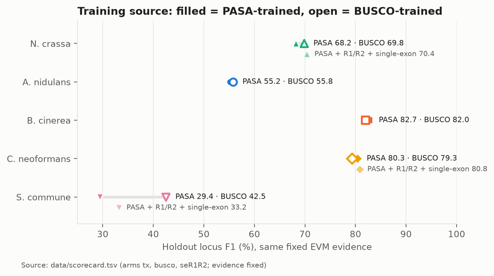
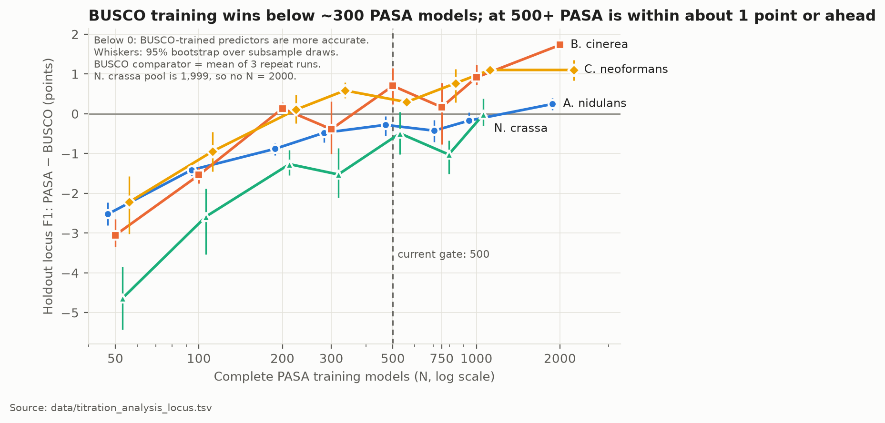
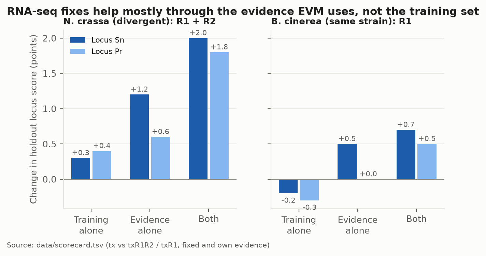
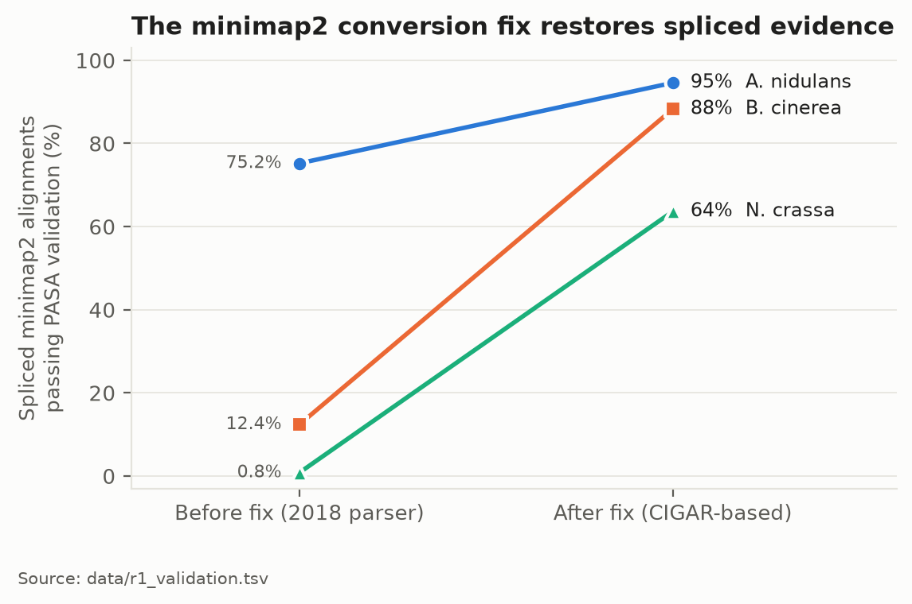
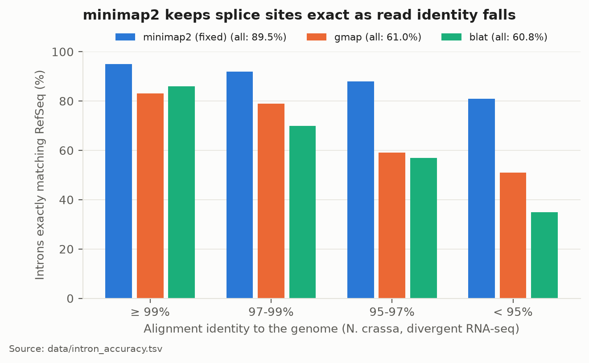
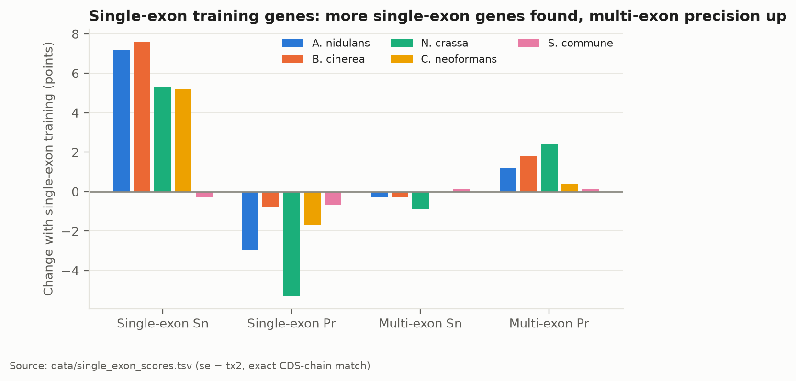
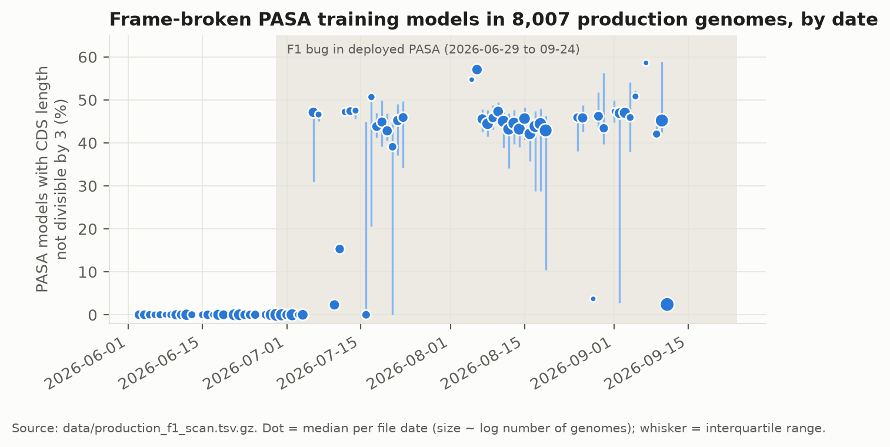
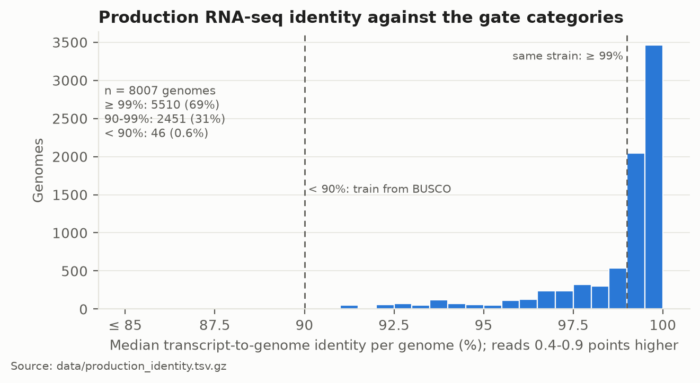
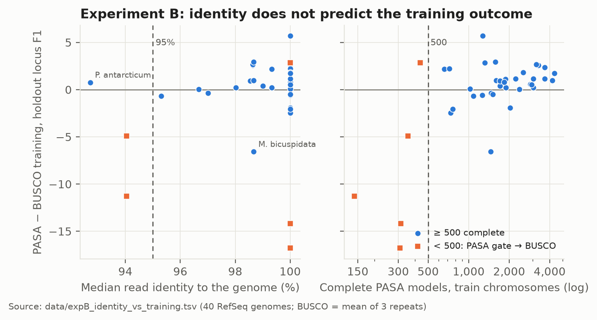

.. _assessment_pasa2.6_fun1.9:

Training and evidence assessment (v1.9.0)
=========================================

This page records how well gene-prediction training and transcript evidence perform in
**funannotate v1.9.0-rc.3** with **PASApipeline v2.6.1-rc.2**, measured against RefSeq annotations in
September 2026. The data, figures (PNG and PDF), analysis scripts and a Markdown version of this page
are in ``docs/assessment_pasa2.6_fun1.9/``.

:Versions assessed: funannotate ``v1.9.0-rc.3`` (commit ``cd1b5ee``); PASApipeline ``v2.6.1-rc.2``
                    (hyphaltip/PASApipeline, commit ``1044957``)
:Baseline:          funannotate ``41a2fd7`` and the ``funannotate-1.9.0-rc.1`` image
:As of:             2026-09-26; experiment B sections 2026-09-28; experiment C 2026-09-29
:Related pages:     :ref:`training`, :ref:`evidence`; the selection methods are in
                    ``docs/training_data_selection_methods.md``

Summary
-------

1. Training Augustus and SNAP from RNA-seq-derived PASA models is rarely better than training from
   BUSCO genes by more than about 1 point. It is clearly worse when fewer than about 300 complete PASA
   models are available.
2. RNA-seq is valuable mainly as evidence for the final gene models, through PASA models in EVM
   (PASA weight 6).
3. funannotate therefore uses RNA-seq in both roles:

   - it trains from PASA only when enough complete models exist (``--min_pasa_complete_models``,
     default 500), and falls back to BUSCO otherwise;
   - it always passes the PASA models to EVM as evidence.

How it was measured
-------------------

- **Genomes.** Five fungal genomes with RefSeq annotation:

  - *Neurospora crassa* OR74A (divergent RNA-seq, 96.7% read identity);
  - *Aspergillus nidulans* FGSC A4 (same-strain RNA-seq);
  - *Botrytis cinerea* B05.10 (same-strain RNA-seq);
  - *Cryptococcus neoformans* H99 (same-strain RNA-seq);
  - *Schizophyllum commune* H4-8 (divergent RNA-seq).
- **Held-out chromosomes.** Chromosomes of at least 1 Mb were assigned alternately to training and
  holdout sets. Augustus and SNAP were trained on the training chromosomes only; only the holdout
  chromosomes were scored.
- **Scoring.** gffcompare (v0.12.10) at CDS level, plus proteome BUSCO (fungi_odb10).
- **Evidence settings.**

  - "Fixed" gives every arm the same EVM evidence, so only the training differs.
  - "Own" gives each arm its own PASA models as evidence.

PASA-trained versus BUSCO-trained predictors
--------------------------------------------

   Holdout locus F1 with the same fixed evidence. Filled marker: PASA-trained; open marker:
   BUSCO-trained. PDF: ``assessment_pasa2.6_fun1.9/figures/fig2_training_source_by_genome.pdf``.

   Experiment A (final). Complete PASA training models were subsampled within each genome and
   compared with BUSCO training on the same evidence. Whiskers: 95% bootstrap over subsample draws.

.. list-table:: Holdout locus F1, PASA-trained minus BUSCO-trained (points). PASA: mean over 3-5 subsets; BUSCO: mean of 3 repeat runs
   :header-rows: 1
   :widths: 24 19 19 19 19

   * - Complete training models
     - *A. nidulans*
     - *B. cinerea*
     - *C. neoformans* H99
     - *N. crassa*
   * - 50
     - −2.5
     - −3.0
     - −2.2
     - −4.6
   * - 100
     - −1.4
     - −1.5
     - −0.9
     - −2.6
   * - 200
     - −0.9
     - +0.1
     - +0.1
     - −1.3
   * - 300
     - −0.5
     - −0.4
     - +0.6
     - −1.5
   * - 500
     - −0.3
     - +0.7
     - +0.3
     - −0.5
   * - 750
     - −0.4
     - +0.2
     - +0.8
     - −1.0
   * - 1000
     - −0.2
     - +0.9
     - +1.1
     - 0.0
   * - 2000
     - +0.2
     - +1.7
     - +1.1
     - (pool 1,999)

- At 100 complete models and below, BUSCO training wins in all four genomes (by 0.9-4.6 points).
- At 500 models and above, the difference is between −1.0 and +1.7 points.
- Under the pre-agreed conservative rule (the lower 95% bound of the difference is at least 0 at that N
  and at every larger N tested), the locus-level crossover is 300 for *C. neoformans*, 1,000 for
  *B. cinerea* and 2,000 for *A. nidulans*. It is not reached for *N. crassa* up to 1,000 (the largest
  N possible). Exon and intron-chain levels give the same values, except *C. neoformans* exon (750).
- The most conservative single threshold over these four genomes is 2,000, where the gain over BUSCO
  is +0.2 to +1.7 points. The funannotate default gate is still 500. Whether to change it is a
  decision for after experiment B (about 40 RefSeq genomes).
- With only 93 complete models (*S. commune*), BUSCO training is ahead by +8.2 locus sensitivity and
  +5.0 precision.

RNA-seq as evidence
-------------------

   Change in holdout locus sensitivity and precision from the alignment fixes, split into the effect of
   the training set alone, the evidence alone, and both.

- On *N. crassa*, the fixes changed locus Sn / Pr as follows:

  - training set alone: +0.3 / +0.4;
  - evidence alone: +1.2 / +0.6;
  - both: +2.0 / +1.8.
- On *B. cinerea* the pattern is the same: training alone −0.2 / −0.3, evidence alone +0.5 / 0.0.
- EVM weights in these runs: PASA 6, Augustus HiQ 2, and 1 each for Augustus, GeneMark, SNAP, proteins
  and transcripts.
- Not measured: the separate contribution of RNA-seq-derived Augustus hints, and GeneMark with
  RNA-seq (these runs used GeneMark-ES).

Transcript alignment quality
----------------------------

   Spliced minimap2 alignments that pass PASA validation, before and after the conversion fix in
   ``library.bam2gff3`` (coordinates from the CIGAR instead of the 2018 ``cs``-tag walk).

   Introns exactly matching a RefSeq intron, by aligner and alignment identity (*N. crassa*,
   divergent RNA-seq).

.. list-table:: Effect of the fixes on PASA training models (exact RefSeq CDS chains)
   :header-rows: 1
   :widths: 40 20 20 20

   * - Change
     - *N. crassa*
     - *B. cinerea*
     - *A. nidulans*
   * - minimap2 conversion fix (R1)
     - 1,481 → 2,096
     - 5,353 → 5,644
     - 3,171 → 3,220
   * - R1 + PASA ``--UNSPLICED_JOIN_SPLICED`` and ``--ONE_ALIGNMENT_PER_CDNA``
     - 2,096 → 2,213
     - 5,644 → 5,649
     - 3,220 → 3,221

- Fixed minimap2 placed 89.5% of introns exactly as RefSeq, against 61.0% for gmap and 60.8% for blat.
- Real minimap2 splice-placement errors were about 1.2% of introns, so no polishing step is needed.
- Relaxing PASA validation (identity 90%, no splice-boundary rule) added training models but did not
  improve predictions.

Single-exon training genes
--------------------------

   Change in exact CDS-chain accuracy when protein-supported single-exon genes are admitted to the
   training set (now the default; ``--no_training_single_exon`` turns it off).

Runtime
-------

- The minimap2 conversion fix increased ``funannotate train`` wall time by 12-20% (*N. crassa*
  1,266 → 1,520 s; *A. nidulans* 905 → 1,015 s), because PASA validates and assembles more alignments.
- gmap as PASA's aligner took 67% longer than blat, with no accuracy gain.

Production data (BFD, 8,007 PASA-trained genomes)
-------------------------------------------------

   PASA training models with CDS length not divisible by 3, by file date. A PASA defect (duplicate
   GFF3 rows) caused frame errors in 5,599 genomes between 2026-07-06 and 2026-09-24. It is fixed in
   PASApipeline v2.6.1-rc.1 and later.

   Median transcript-to-genome identity per genome against the read-identity categories (same strain
   ≥ 99%; divergent 90-99%; below 90% trains from BUSCO).

RNA-seq read identity as a training gate
----------------------------------------

A user reported that RNA-seq from a related species (*P. brasiliensis* reads on the
*P. lobogeorgii* genome: 79.8% mapped, 93.6% median read identity) passes the 10% map-rate gate, and
that BUSCO training was better than PASA training there. The map rate cannot detect such reads,
because minimap2 aligns them well. The full analysis is section 4 of ``README.md``.

- **Change (working tree, 2026-09-28).** train measures the median read identity
  (1 − NM / aligned bases) with the same 200,000 reads as the map-rate gate, and records it; it never
  stops on it. predict has ``--min_rnaseq_identity`` (default 0 = off). Above 0, below the
  threshold, the predictors train from BUSCO, and the RNA-seq BAM, PASA models and transcripts are
  still used as hints and EVM evidence.
- **Measurement.** Median read identity was measured for the 40 experiment B RefSeq genomes and
  compared with the holdout locus F1 of PASA and BUSCO training.

   PASA − BUSCO training, holdout locus F1, against read identity (left) and the number of complete
   PASA models (right). Orange: fewer than 500 complete models, which the PASA gate already sends to
   BUSCO. PDF: ``assessment_pasa2.6_fun1.9/figures/fig9_identity_vs_training_outcome.pdf``.

- **Identity does not predict the training outcome.** Spearman ρ = 0.18 (40 genomes; 0.12 with
  ≥ 500 complete models). The complete-model count does (ρ = 0.42). The two are not correlated
  (ρ = 0.02).
- **A 95% default is not supported.** Only 3 genomes are below 95%. The PASA gate already sends two of
  them to BUSCO. For the third (*P. antarcticum*, 92.7%), PASA training was 0.77 points better. No
  threshold from 93% to 99.5% gives a net gain.
- **RNA-seq evidence helps even for divergent reads.** With BUSCO training, RNA-seq evidence raised
  holdout locus F1 by a mean of +7.5 points (95% CI +4.5 to +11.5), in 12 of 12 genomes, including
  all 5 below 99% identity. Low identity must therefore change only the training source.
- **Decision (2026-09-28).** The default is 0 (report only). train still records identity for
  every run.

The complete-model gate across 40 genomes
-----------------------------------------

The same 40 genomes test the PASA gate (``--min_pasa_complete_models``) across species. The full
tables are in section 5 of ``README.md``.

- **In experiment B units, 500 works.** Counting complete models on the training chromosomes, the
  policy "PASA if at least 500 complete models, else BUSCO" gains +1.11 holdout locus F1 (95% CI
  +0.05 to +2.48) over always training from PASA. The gain is flat from 350 to 1,500 models.
- **In production units, 500 is not calibrated.** Production counts on the whole genome, which has
  about 2 times more models (1.5-15 times). With whole-genome counts, 500 would stop only 1 of the 5
  genomes that lost badly, and the gain falls to +0.35 (0.00 to +1.06); at 1,000 it is +1.18. The
  losses were measured with training on half-genome sets, so training on the full set may do better.
  An earlier version of this page said the default of 500 was supported; that did not take the
  difference in counts into account.

- **Below 500:** 4 of 5 genomes lost 4.9-16.8 points with PASA training.
- **Six yeasts** passed the 500 gate but kept fewer than 300 models after selection. Four of them
  lost with PASA training. A second gate on this count changed the mean by +0.18 (−0.17 to +0.59)
  and is not supported yet.

Experiment C: the gate in production units
------------------------------------------

Eight genomes were trained on the whole genome from PASA and from BUSCO (3 repeats each) and scored
on all RefSeq genes that overlap no training model. Full tables: section 6 of ``README.md``.

- **Genomes with 482-976 whole-genome complete models lost 6.6-18.2 locus F1 points** with PASA
  training (E. xenobiotica, S. commune, P. hubeiensis, A. niger). Training on all of their models did
  not rescue them. Three of them pass the default gate of 500.
- **Genomes with 3,937-7,041 complete models gained 0.4-2.7 points** with PASA training.
- **Repeat noise is small** (SD at most 0.15 points), so these differences are not run-to-run noise.
- **So 500 is too low in production units; about 1,000 separates the 8 genomes.** No genome in
  experiment C had 977-3,936 models, so the exact value is open. Changing the default is a user
  decision.
- The complete-model count also depends on the train path: the same reads gave 482 complete models
  through the BFD shared-Trinity path and 6,778 with a full own train for E. xenobiotica.

Gate wiring test
----------------

The identity code (funannotate ``d18e67c``) was run against rc.3 with identical external tools.
41 checks: 33 PASS, 0 FAIL, 8 INFO. Training decisions and training sets are identical at default
settings; the identity and PASA gates switch in the right direction at the exact boundary; and
predict finds train's identity report in the BFD pipeline's pruned layout. See section 7 of
``README.md``.

Open items
----------

- Experiment A: add *C. neoformans* H99, and repeat the BUSCO comparator on the same code snapshot.
- The default of ``--min_pasa_complete_models`` (500 now; about 1,000 suggested by experiment C).
- Accuracy of shared-Trinity against own-train PASA sets of the same genome.
- Training-set selection in intron-poor yeasts.
- Whether RNA-seq that fails the map-rate gate still helps as evidence.
- A hints-on versus hints-off arm; GeneMark-ET/EP; refitting EVM weights after the fixes.

Files
-----

All paths are relative to ``docs/assessment_pasa2.6_fun1.9/``.

- ``README.md``: this assessment in Markdown, with the full tables.
- ``evidence_and_alignment_methods.md``: methods and results draft for the evidence and alignment work.
- ``DECISIONS_snapshot_2026-09-26.md``: the decision log.
- ``data/``: the result tables every number comes from.
- ``figures/``: PNG and PDF figures, and ``make_figures.py``, which regenerates them from ``data/``.
- ``scripts/``: the analysis and scoring scripts.
